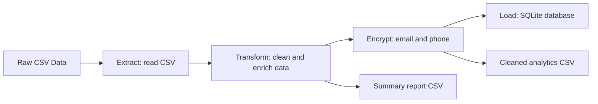

# Secure Data Pipeline for Analytics

A beginner-friendly Python ETL project that reads customer data from CSV, cleans it, encrypts sensitive fields, stores the processed records in SQLite, and creates analytics-ready CSV outputs.

This project is designed for a Python Backend Developer resume because it demonstrates ETL, data cleaning, secure data handling, database storage, and Git/GitHub workflow in a small, easy-to-explain codebase.

## Tech Stack

- Python
- Pandas
- SQLite
- Cryptography using Fernet symmetric encryption
- Git and GitHub

## Features

- Reads customer records from `data/raw_customers.csv`
- Removes duplicate records
- Handles missing values
- Standardizes names, emails, phone numbers, countries, and dates
- Adds analytics fields such as signup year, signup month, and customer value segment
- Encrypts email addresses and phone numbers before storage
- Stores secure processed data in SQLite
- Generates `cleaned_data.csv` and `summary_report.csv`

## Project Structure

```text
secure_data_pipeline/
|
|-- data/
|   |-- raw_customers.csv
|   |-- cleaned_data.csv
|   `-- summary_report.csv
|
|-- database/
|   `-- customers.db
|
|-- pipeline/
|   |-- extract.py
|   |-- transform.py
|   |-- encrypt.py
|   `-- load.py
|
|-- main.py
|-- requirements.txt
|-- .gitignore
`-- README.md
```

## Architecture



## Setup Instructions

1. Clone or download this project.

2. Open a terminal inside the project folder:

```bash
cd secure_data_pipeline
```

3. Create and activate a virtual environment:

```bash
python -m venv .venv
.venv\Scripts\activate
```

On macOS or Linux:

```bash
python3 -m venv .venv
source .venv/bin/activate
```

4. Install dependencies:

```bash
pip install -r requirements.txt
```

5. Run the ETL pipeline:

```bash
python main.py
```

## Generated Outputs

After running the pipeline, these files are created locally:

- `data/cleaned_data.csv`
- `data/summary_report.csv`
- `database/customers.db`
- `encryption.key`

The encryption key is ignored by Git because it is a local secret. Do not upload it to GitHub.

## How the ETL Pipeline Works

### Extract

`pipeline/extract.py` reads the customer CSV file and checks that all required columns are present.

### Transform

`pipeline/transform.py` removes duplicates, fills missing values, standardizes text, converts dates, and adds analytics fields.

### Encrypt

`pipeline/encrypt.py` uses Fernet encryption to encrypt email addresses and phone numbers. The final stored data does not include plaintext email or phone values.

### Load

`pipeline/load.py` saves the secure processed records into a SQLite database and writes CSV files for analytics.

## SQLite Database

The processed customer records are saved in:

```text
database/customers.db
```

The table name is:

```text
customers
```

You can inspect it with any SQLite browser or with Python.

## Screenshots

Add screenshots here after running the project:

### Pipeline Run


### Cleaned CSV Output


### SQLite Table


## Resume Talking Points

- Built a modular ETL pipeline using Python and Pandas
- Cleaned messy customer data by handling duplicates, missing values, and inconsistent formats
- Applied Fernet encryption to protect sensitive customer fields
- Stored processed records in a SQLite database
- Generated analytics-ready CSV outputs for reporting
- Used Git and GitHub-ready project structure with a professional README

## GitHub Push Commands

Create an empty GitHub repository named `secure-data-pipeline-for-analytics`, then run:

```bash
git init
git add .
git commit -m "Initial commit: secure data pipeline for analytics"
git branch -M main
git remote add origin https://github.com/parvesh-goyat/secure-data-pipeline-for-analytics.git
git push -u origin main
```

## Important Security Note

This project is for learning and portfolio demonstration. In real production systems, encryption keys should be managed using a secure key management service, environment variables, or a secrets manager instead of being stored as local files.
